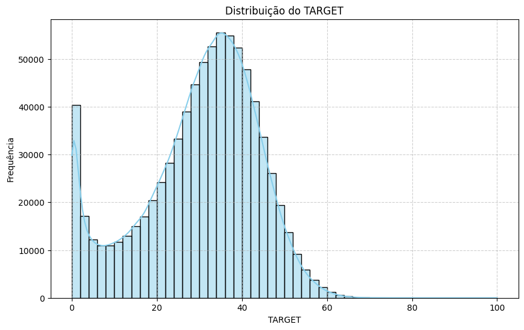

# Feature Engineering – News Recommender

Este documento descreve o módulo de **Feature Engineering** do projeto News Recommender. Nele, são realizadas as transformações e extrações necessárias para gerar as features que alimentarão o modelo de engajamento. Este README foca exclusivamente na preparação e transformação dos dados, enquanto informações sobre execução do pipeline e configuração de variáveis de ambiente estão disponíveis no README global do projeto.

---

## Índice

- [Visão Geral](#visão-geral)
- [Arquitetura e Fluxo de Dados](#arquitetura-e-fluxo-de-dados)
- [Pré-processamento](#pré-processamento)
  - [Notícias](#notícias)
  - [Usuários](#usuários)
  - [Mix de Features](#mix-de-features)
  - [TARGET – Engajamento](#target--engajamento)
- [Referências e Documentação Complementar](#referências-e-documentação-complementar)

---

## Visão Geral

O módulo de Feature Engineering tem como objetivo preparar os dados para a etapa de treinamento do modelo. Essa preparação envolve:

- **Extração e transformação dos dados de notícias e usuários:**  
  Processamento dos arquivos CSV, tratamento de timestamps, extração de features temporais e outras transformações necessárias.

- **Combinação dos dados em um DataFrame único:**  
  Integração dos dados de notícias e usuários através da chave `pageId` para gerar um mix de features que agrega informações de diversas dimensões, como gap temporal e contagens por categoria.

- **Cálculo do TARGET (Score de Engajamento):**  
  O score de engajamento é calculado para cada par **usuário-notícia**, combinando métricas como número de cliques, tempo na página, scroll, recência, tamanho do histórico e gap temporal.

---

## Arquitetura e Fluxo de Dados

O fluxo de Feature Engineering está organizado em quatro principais blocos:

1. **Pré-processamento de Notícias:**  
   - **Descrição:** Concatena os arquivos CSV do diretório de notícias, filtra os registros com base nos `pageId` desejados e extrai informações relevantes da URL (como `localState`, `localRegion`, `themeMain` e `themeSub`). Converte os campos de data/hora para gerar os valores de `issuedDate` e `issuedTime`.
   - **Arquivo principal:** `pp_news.py`

2. **Pré-processamento de Usuários:**  
   - **Descrição:** Carrega os dados dos usuários a partir dos arquivos CSV, aplica amostragem, processa colunas de histórico, converte timestamps e extrai novas features temporais (como `isWeekend` e `dayPeriod`). Define a flag `coldStart` para identificar usuários com histórico insuficiente.
   - **Arquivo principal:** `pp_users.py`

3. **Mix de Features:**  
   - **Descrição:** Combina os dados de notícias e usuários (através do `pageId`) para gerar um DataFrame único (mix_feats). Durante esse processo, são criadas colunas combinadas (como `issuedDatetime`) e calculados:
     - **Gap Temporal:** Diferença entre a publicação e o consumo da notícia.
     - **Contagens e Proporções por Categoria:** Quantidade e fração de notícias consumidas por usuário para cada categoria (estado, região, temas).
   - **Arquivo principal:** `pp_mix.py`

4. **TARGET – Engajamento:**  
   - **Descrição:** Calcula o score de engajamento (TARGET) para cada par **usuário-notícia** com base em múltiplas métricas:
     
     1. **Score Base:**  
        Combinação de:
        - `numberOfClicksHistory`
        - `1.5 * (timeOnPageHistory / 1000)`
        - `scrollPercentageHistory`
        - Penalização por `minutesSinceLastVisit` (dividido por 60)
        
        A expressão para o score base é:
        
        ```
        scoreBase = numberOfClicksHistory 
                    + 1.5 * (timeOnPageHistory / 1000)
                    + scrollPercentageHistory
                    - (minutesSinceLastVisit / 60)
        ```
     
     2. **Ajuste com Fatores:**  
        O score base é multiplicado pelos fatores:
        - **Histórico:** `historySize / 130`
        - **Gap de Publicação:** `1 / (1 + (timeGapDays / 50))`
        
        Assim:
        
        ```
        rawScore = scoreBase * (historySize / 130) * (1 / (1 + (timeGapDays / 50)))
        ```
        
        Valores negativos são ajustados para zero.
     
     3. **Transformações Finais:**  
        - Aplicação de `log1p(rawScore)`
        - Escalonamento via Min-Max Scaling para transformar o resultado no intervalo [0, SCALING_RANGE]
        - Arredondamento e conversão para inteiro
        
   - **Arquivo principal:** `pp_target.py`

Abaixo, uma figura da distribuição do nosso target:



---

## Referências e Documentação Complementar

Este README.md documenta apenas a parte de Feature Engineering do projeto. Cada módulo possui sua própria documentação detalhada:

- **Treinamento do Modelo:** Consulte o README no diretório `src/train/`.
- **API de Predição:** Consulte o README no diretório `src/api/`.
- **Utilitários e Outras Funcionalidades:** Consulte os módulos `utils.py`, `schemas.py` e `constants.py`.

Para mais detalhes sobre cada etapa, revise os arquivos de código ou entre em contato com a equipe de desenvolvimento.

---

Este documento fornece uma visão detalhada do fluxo de Feature Engineering, com ênfase na preparação dos dados e no cálculo do score de engajamento (TARGET) utilizando a equação descrita acima. Para uma visão completa do sistema, consulte os READMEs específicos de cada módulo do projeto.